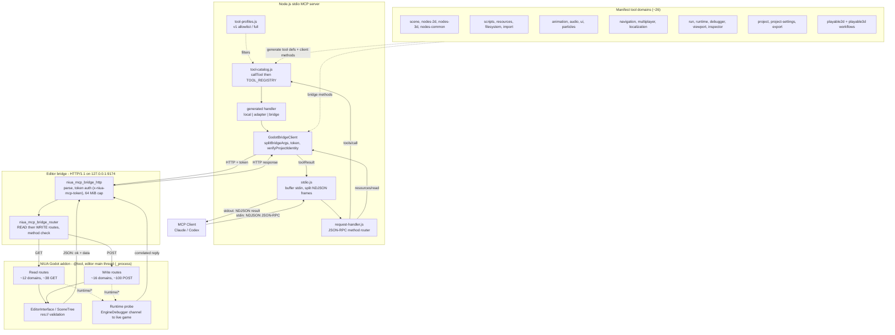

# NIUA Godot MCP — Official Manual

The NIUA Godot MCP lets an AI agent build, run, and debug real Godot 4 games by talking to a **live Godot editor**. It exposes Godot's editor and a running game as a set of Model Context Protocol (MCP) tools, so a client like Claude or Codex can create scenes, wire scripts, place nodes, launch the game, watch it run, and screenshot the result — the same actions a developer performs by hand, driven by natural language.

This manual covers what it is, everything it can do (grouped by subsystem), the **Safe Build Loop** you should follow every time, the `core`/`full`/`compact` tool profiles, setup, and a Troubleshooting guide for the sharp edges you may hit on camera.

---

## 1. What it is

- **A local, editor-attached MCP server.** It is a plain Node.js JSON-RPC-over-stdio server (no SDK). Your MCP client speaks to it over stdin/stdout using newline-delimited JSON (NDJSON) — one JSON-RPC message per line.
- **Backed by a Godot addon.** The Node server does not touch Godot's internals directly. It forwards every real action over a tiny local HTTP bridge to the **NIUA Godot addon** running inside your editor. The addon services requests **on the editor's main thread**, so it can safely mutate the scene tree and `EditorInterface`.
- **Two views of your game.** The **editor bridge** edits your project (scenes, scripts, resources, settings). A separate **runtime probe** (over Godot's `EngineDebugger` channel) inspects and screenshots the *running* game.
- **Local-first and trust-scoped.** The bridge binds only to `127.0.0.1` and is guarded by a per-session token. Filesystem writes are confined to `res://`. It is a trusted dev tool, not a sandbox — see the Security notes below.

**At a glance**

| | |
|---|---|
| Transport | JSON-RPC 2.0 over stdio, NDJSON framing |
| Editor bridge | HTTP/1.1 on `127.0.0.1:9174` (default), `x-niua-mcp-token` auth |
| Godot version | 4.6.x |
| Node version | >= 20 |
| Default tool profile | `core` (~52 kernel tools); `full` = every stable tool (~146); `compact` = the stable surface behind 13 routers; 32 experimental tools hidden unless `NIUA_MCP_EXPERIMENTAL=on` |
| Filesystem writes | `res://` only, 64 MiB payload cap |
| Managed projects | Confined to `GODOT_MCP_ALLOWED_PROJECT_ROOTS` (default `./runs`) |

---

## 2. How a call flows (architecture)

```
MCP client  →  Node stdio server  →  HTTP bridge (token, localhost)  →  Godot addon  →  Editor / running game
```

1. **stdio server** (`stdio.js`) buffers stdin, splits NDJSON frames, and routes each JSON-RPC message (`request-handler.js`).
2. A `tools/call` goes to `callTool` (`tool-catalog.js`), which looks the tool up in a name-indexed registry built from the **profile-filtered** catalog.
3. The tool's generated handler runs. For bridge-backed tools it splits connection args from payload, builds a `GodotBridgeClient`, and issues an HTTP request to the editor bridge.
4. Inside Godot, the addon's `_process` tick pumps the HTTP server, authenticates the token, routes the path (read vs write), and runs the matching handler against `EditorInterface`/the scene tree (or the runtime probe).
5. The `{ok, data}` result travels back over HTTP → handler → stdout as a single NDJSON response line.

The entire tool surface is **manifest-driven**: each domain declares tools as data, and code generators produce (a) the MCP tool definitions, (b) the HTTP client methods, and (c) the Godot route table from the same specs — so the JS client and the GDScript server can't drift apart.

---

## 3. Capability surface (by subsystem)

The catalog spans ~26 domains. Here is the whole surface, grouped by what you'll actually reach for. Subsystems marked **(experimental)** have passed the conformance gate but not yet been proven in real game builds — they are hidden from every profile unless `NIUA_MCP_EXPERIMENTAL=on` (see the environment table).

### Project & process lifecycle
Launch and manage Godot editor processes and discover existing ones.
- `create_project`, `open_project`, `close_project`, `import_project`
- `discover_projects`, `discover_editor_bridges`, `list_known_projects`, `forget_project`, `get_open_projects`
- `install_project_addon`, `get_project_info`, `get_godot_version`
- `diagnose_project_setup` (health check for a project/bridge)

`open_project` negotiates a bridge port + token, spawns `godot [--headless] --path <root> --editor`, and polls `/health` until the bridge is ready. Managed projects must live under `GODOT_MCP_ALLOWED_PROJECT_ROOTS` (default `./runs`).

### Scenes
- `create_scene` (always saves to a `res://` path and opens it), `open_scene`, `close_scene`, `list_scenes`
- `save_current_scene`, `save_scene_as`, `switch_scene_tab`
- `get_scene_tree`, `get_open_scene_tabs`, `mark_scene_unsaved`
- `set_main_scene` (which scene runs on Play)

### Node authoring
- Generic tree ops: `create_node`, `create_node_with_script`, `delete_node`, `rename_node`, `duplicate_node`, `reparent_node`, `reorder_node`, `set_node_property`, `focus_node`, `search_node_types`
- 2D primitives: `create_sprite_2d`, `create_animated_sprite_2d`, `create_camera_2d`, `create_character_body_2d`, `create_static_body_2d`, `create_area_2d`, `create_collision_shape_2d`
- 3D primitives: `create_mesh_instance_3d`, `create_camera_3d`, `create_light_3d`, `create_character_body_3d`, `create_rigid_body_3d`, `create_static_body_3d`, `create_area_3d`, `create_collision_shape_3d`

### Scripting
- `create_script`, `write_script`, `attach_script`, `read_script`, `replace_in_scripts`
- `open_script`, `goto_script_line`, `get_script_symbols`, `get_script_cursor_state`, `get_script_editor_state`
- `validate_script`, `diagnose_script`, `diagnose_project_scripts` (headless `--check-only` compile checks)

Scripts allow arbitrary GDScript by design — the agent is trusted.

### Resources & materials
- `create_resource`, `save_resource`, `open_resource`, `focus_resource`
- `create_material`, `assign_material`, `create_shader_material`
- `create_sprite_frames`, `create_tile_set`, `create_tile_map_layer`, `set_tile_map_layer_cells`, `paint_tile_map_layer_terrain`

### Filesystem (`res://` only)
- `read_text_file`, `write_text_file`, `write_binary_file`
- `list_filesystem`, `get_filesystem_dock_state`, `create_folder`
- `copy_filesystem_entry`, `move_filesystem_entry`, `delete_filesystem_entry`, `batch_filesystem_operations`

### Import pipeline
- `import_project_assets`, `reimport_assets`, `list_imported_assets`
- `get_import_diagnostics`, `get_import_events`, `get_import_metadata`, `set_import_options`

### Run & runtime probe
- Run control: `run_main_scene`, `run_current_scene`, `run_custom_scene`, `stop_running_scene`, `reload_running_scene`, `get_run_status`, `get_run_settings`
- Runtime probe (live game): `install_runtime_probe`, `get_runtime_state`, `get_runtime_events`, `get_runtime_node_properties`, `set_runtime_node_property`, `capture_runtime_screenshot`

The runtime probe serializes the live scene tree (bounded to depth 8 / 64 children / 200 properties per node) and grabs the running viewport as a base64 PNG. In headless (dummy renderer) screenshots return `available:false`.

### Editor & viewport
- `get_editor_state`, `set_editor_main_screen`, `invoke_editor_action`, `undo_editor_action`, `redo_editor_action`
- `capture_editor_screenshot`, `capture_viewport_screenshot`, `get_viewport_state`, `set_viewport_camera`, `send_viewport_input`
- `get_selection`, `set_selection`
- Inspector: `get_inspector_properties`

### Debugger **(experimental)**
- `get_debugger_state`, `set_debugger_breakpoint`, `send_debugger_message`, `toggle_debugger_profiler`

### Animation
- `list_animations`, `upsert_animation`, `play_animation`, `stop_animation`, `get_animation_state`
- `create_animation_tree_state_machine`, `travel_animation_tree`
- `create_animated_sprite_2d`, `instance_animated_scene`

### Audio
- `create_audio_stream_player`, `list_audio_buses`, `upsert_audio_bus`, `remove_audio_bus`, `upsert_audio_bus_effect`

### UI & theming
- `create_ui_control`, `set_control_layout`, `connect_ui_signal`
- `create_ui_theme`, `apply_ui_theme_override`

### Particles
- `create_gpu_particles_2d`, `create_gpu_particles_3d`, `configure_particle_process_material`, `set_particles_emitting`

### Navigation **(experimental)**
- `create_navigation_region_3d`, `bake_navigation_mesh_3d`, `create_navigation_agent_3d`, `create_navigation_target_follow_script`

### Localization **(experimental)**
- `create_csv_translation`, `register_translation_file`, `set_locale`, `get_localization_state`

### Multiplayer **(experimental)**
- `create_multiplayer_synchronizer`, `create_multiplayer_spawner`, `create_enet_multiplayer_script`, `create_multiplayer_state_script`

### Project settings & input
- `get_project_settings`, `get_project_setting`, `set_project_setting`, `set_project_setting_metadata`
- `get_input_map`, `set_input_action`

### Export **(experimental)**
- `list_export_presets`, `upsert_export_preset`, `validate_export_preset`, `diagnose_export_templates`, `export_project`

### High-level "playable" workflows
One call that scaffolds a runnable slice — nodes, input actions, and a controller script together:
- `create_2d_playable_blockout`, `create_2d_character_controller`, `create_2d_trigger_zone`
- `create_3d_playable_blockout`, `create_3d_character_controller`

### MCP resources (read-only)
Exposed as `godot://` URIs via `resources/list` + `resources/read`: project info, editor state, filesystem listing, runtime state, scene tree, and logs.

---

## 4. The SAFE BUILD LOOP

This is the golden path. Follow it in order and you avoid almost every sharp edge in the Troubleshooting section (most of which are triggered by building on an **unsaved / untitled** scene).

```
create/open scene  →  build nodes  →  save to a res:// path  →  set_main_scene  →  run  →  observe/screenshot  →  stop
```

1. **Create or open a scene — with a path.** Prefer `create_scene` with a `res://…tscn` path. It always writes the file and opens it, so the scene is *titled* from the start. Do not build on the editor's default untitled tab.
2. **Build nodes.** Use `create_node`, the 2D/3D primitives, or a `create_*_playable_blockout` workflow. When setting properties, **use typed values** (e.g. `{"type":"Vector2","x":100,"y":50}`) and **exact property names/casing**.
3. **Save to `res://`.** Call `save_current_scene` (the scene already has a path from step 1). After tool-driven edits, also call `mark_scene_unsaved` if you rely on the "unsaved" flag — direct tree mutations don't set it automatically.
4. **`set_main_scene`.** Point the project at the scene you want Play to launch, so `run_main_scene` is deterministic.
5. **Run.** Use `run_main_scene` (main scene) or `run_current_scene`. Because your scene is saved and titled, the editor won't pop a Save-As dialog.
6. **Observe / screenshot.** `get_runtime_state`, `get_runtime_events`, `get_runtime_node_properties`, and `capture_runtime_screenshot` to see what actually happened in the running game. (Install the runtime probe once via `install_runtime_probe` if needed.)
7. **Stop.** `stop_running_scene` before the next iteration.

> **Why "save first" matters:** Several editor actions (`invoke_editor_action("save_all_scenes")`, and `run_main_scene`/`run_custom_scene` with Godot's default *save-before-run*) delegate to Godot's **GUI** save flow when any open scene is untitled. That pops a modal Save-As dialog the agent cannot dismiss. A scene created via `create_scene` is always titled, so this never fires on the golden path.

---

## 5. `core`, `full`, and `compact` profiles

The advertised tool count is gated by the `NIUA_MCP_PROFILE` env var (or `--profile` at setup).

- **`core` (default, 55 tools).** Derived from per-tool tier metadata; every member earned its place in a real game build. Kept small on purpose: this MCP is designed to coexist in one session alongside the NIUA and Blender MCPs without blowing the context window.
- **`full` (~146 stable tools).** Every stable tool across all ~26 domains. Experimental subsystems stay hidden unless `NIUA_MCP_EXPERIMENTAL=on`. Schema cost: tens of thousands of tokens per request on clients without deferred tool loading.
- **`compact` (13 tools, ~4K tokens).** The full surface behind ~12 action-routed domain tools (`godot_scene`, `godot_node`, `godot_builder`, …) plus `apply_scene_recipe`. Call `{ action: "describe" }` to list a domain's actions, `{ action: "describe", name: "<action>" }` for that action's full argument schema, then `{ action: "<action>", args: { … } }` to run it. Built for schema-injecting clients (Cursor, Codex, most non-Claude harnesses): ~92% less schema tax than `full` with nothing hidden.

The historical profile names `v1` (now `core`) and `dispatch` (now `compact`) remain accepted as permanent aliases.

The profiles are computed projections of one capability graph: `core` is derived at load from the `tier: "essential"` field in the tool manifests (no hand-maintained allowlist to drift), and a tool earns that tier by being needed in real runs. Every profile also exposes `describe_tools`, the catalog navigator — call it with no args for the domain map, `{ domain }` for a domain's tools, or `{ name }` for one tool's full schema; it always describes the entire catalog, even tools the active profile hides.

If an agent calls a `full`-only tool while running under `core`, the server returns a helpful error explaining the tool is hidden by the active profile and to **restart with `NIUA_MCP_PROFILE=full`** (versus a genuinely unknown tool name). Switching profiles requires restarting the MCP server so the registry rebuilds.

---

## 6. Setup

**Prerequisites:** Node >= 20, Godot 4.6 on your PATH (or set `GODOT_BIN` to its full path).

### From source

```bash
git clone <lab-niua repo>
cd lab-niua
npm install
```

Generate a client config with the built-in setup command (dry-run by default; add `--write` to apply):

```bash
# Claude Desktop
node src/godot-mcp/cli.js setup \
  --client claude \
  --project-root /abs/path/to/your/runs \
  --profile v1 \
  --godot-bin /usr/bin/godot \
  --write

# Codex
node src/godot-mcp/cli.js setup --client codex --project-root /abs/path/to/runs --write

# Generic (prints JSON, writes nothing unless --write + --config-path)
node src/godot-mcp/cli.js setup --client generic --project-root /abs/path/to/runs
```

Run the server directly if you wire it up by hand: `node src/godot-mcp/server.js` (equivalently `npm run godot:mcp`).

### Client config (what setup writes)

**Claude / generic** — JSON, merged into `mcpServers` (existing servers preserved; a `.bak-<timestamp>` is made):

```json
{
  "mcpServers": {
    "niua-godot": {
      "command": "node",
      "args": ["/abs/path/to/lab-niua/src/godot-mcp/server.js"],
      "env": {
        "NIUA_MCP_PROFILE": "core",
        "GODOT_BIN": "godot",
        "GODOT_MCP_ALLOWED_PROJECT_ROOTS": "/abs/path/to/runs"
      }
    }
  }
}
```

Default config path (Claude): macOS `~/Library/Application Support/Claude/claude_desktop_config.json`, Linux `~/.config/Claude/claude_desktop_config.json`, Windows `%APPDATA%\Claude\claude_desktop_config.json`.

**Codex** — TOML, appended to `~/.codex/config.toml`:

```toml
[mcp_servers.niua-godot]
command = "node"
args = ["/abs/path/to/lab-niua/src/godot-mcp/server.js"]
startup_timeout_sec = 120

[mcp_servers.niua-godot.env]
NIUA_MCP_PROFILE = "core"
GODOT_BIN = "godot"
GODOT_MCP_ALLOWED_PROJECT_ROOTS = "/abs/path/to/runs"
```

**Restart the MCP client after writing config**, then call `get_godot_version` to confirm the server is alive. By default, setup runs an `initialize + tools/list` stdio smoke test and reports the tool count.

### Useful environment variables

| Variable | Purpose | Default |
|---|---|---|
| `NIUA_MCP_PROFILE` | Tool profile (`core`/`full`/`compact`; `v1` and `dispatch` remain aliases) | `core` |
| `GODOT_BIN` | Godot executable | `godot` |
| `GODOT_MCP_ALLOWED_PROJECT_ROOTS` | Allowed project roots | `./runs` |
| `NIUA_MCP_PORT` / `GODOT_MCP_PORT` | Bridge port | `9174` |
| `NIUA_MCP_TOKEN` / `GODOT_MCP_TOKEN` | Bridge auth token | per-session generated |
| `GODOT_MCP_HEADLESS` / `NIUA_MCP_HEADLESS` | Launch headless | off |
| `NIUA_MCP_MAX_PAYLOAD_BYTES` | File-write payload cap | 64 MiB |
| `NIUA_MCP_USAGE_STATS` | Local tool-usage counters (set `off` to disable) | on |
| `NIUA_MCP_EXPERIMENTAL` | Expose under-development tools (multiplayer, localization, navigation, tilemaps, export, debugger control, animation-tree, UI theming, 2D workflow builders) | off |
| `NIUA_MCP_USAGE_DIR` | Where usage counter files are written | `runs/tool-usage` |

Usage counters are local-only and counts-only: per-session JSON files record tool names, call counts, and error counts — never arguments, paths, or project names, and nothing leaves the machine. They exist so future default profiles can be derived from real usage instead of guesses.

### Pre-flight doctor

```bash
node src/godot-mcp/doctor.js --project /abs/path/to/your/project
# or: niua-godot-mcp-doctor --project ...
```

Checks Node version, tool profile, `godot --version`, bundled addon files, and a token-authenticated `/health` probe. **Caveat:** if `GODOT_MCP_ALLOWED_PROJECT_ROOTS` is unset, doctor may report a green PASS for a project the live server will still reject (it treats an empty allowlist as "no restriction," while the server defaults to `./runs`). Keep your projects under the allowed roots to avoid a surprise `outside allowed project roots` error on the first `open_project`.

### Security posture (read before a public demo)

- Bridge is **loopback-only** (`127.0.0.1`) and **token-authenticated** (`x-niua-mcp-token`; if no token is configured, the bridge is open).
- Any client that reaches the bridge is **fully trusted** to edit the project. There is **no GDScript sandbox** — `create_script`/`write_script`/`attach_script` run arbitrary GDScript by design.
- Writes are confined to `res://` (no `..`, no absolute paths, no symlink crossings; `res://.godot/` and `res://addons/niua_mcp/` are protected on the filesystem routes). Payloads capped at 64 MiB.
- Out of scope: a malicious trusted agent, malicious agent-authored GDScript, a compromised local account, or other local processes that can read the token from the shared environment.

---

## 7. Troubleshooting (symptom → cause → fix)

Grouped by what you'll see. The single biggest cause of trouble is **building on an unsaved/untitled scene** — the Safe Build Loop avoids most of these.

### A. Editor gets stuck or a modal appears

**Symptom: a Save-As dialog is stuck over the editor after you asked to "save all" or after a run, and it blocks further actions.**
- *Cause:* `invoke_editor_action("save_all_scenes")` on an untitled scene, or `run_main_scene`/`run_custom_scene` while any open tab is untitled and dirty (Godot's default *save-before-run* triggers the GUI Save-All flow). The tool may even return `ok:true` while nothing was saved.
- *Fix:* Never call `save_all_scenes` while an untitled scene is open. Save every scene to a `res://` path first (`create_scene` does this automatically; otherwise `save_scene_as`). If a dialog is already stuck, dismiss it manually in the editor, then re-run. Note `run_current_scene` guards the *current* tab but not a background untitled tab.

### B. A tool reports success but nothing changed (silent no-ops)

**Symptom: `set_node_property` returns `ok:true` but the value never took effect.**
- *Cause:* An unknown/misspelled/wrong-case property, or an untyped value (e.g. `{"x":100,"y":50}` without `"type":"Vector2"`). Godot's `Object.set()` silently no-ops, and the tool echoes back a stale/`null` value as if it worked.
- *Fix:* Use exact property names and casing; wrap values with their type (`{"type":"Vector2",...}`). Read back with `get_inspector_properties` to confirm.

**Symptom: you added several nodes but `get_open_scene_tabs` says `unsaved:false`, and `undo_editor_action` won't undo your changes.**
- *Cause:* Direct tree mutations don't mark the scene dirty or populate the editor's UndoRedo history.
- *Fix:* Call `mark_scene_unsaved` after mutations and save explicitly; don't rely on `undo_editor_action` to reverse tool-made edits.

**Symptom: `attach_script` returned `ok:true`, but at runtime the character is inert.**
- *Cause:* The script's base class is incompatible with the node type (e.g. a `CharacterBody2D` controller script attached to a plain `Node2D`). Godot refuses to instance it (console error only) but the tool still reports success.
- *Fix:* Attach controller scripts only to matching body types (`CharacterBody2D/3D`). The `create_*_playable_blockout` workflows build the correct body for you.

**Symptom: `create_animation_tree_state_machine` / `travel_animation_tree` succeed but nothing animates; Output panel fills with "no animation named…".**
- *Cause:* Referenced animation/state names don't resolve (case mismatch or wrong library); the tools don't validate them.
- *Fix:* Match animation and state names exactly (including case and any library prefix) to what the `AnimationPlayer` actually has.

**Symptom: a `rotation_3d` animation track plays but nothing rotates.**
- *Cause:* The value codec has no `Quaternion` support, so rotation keyframes are silently dropped (`trackCount` counts tracks, not keys).
- *Fix:* Until patched, animate rotation another way; `position_3d`/`scale_3d` work when values are wrapped as typed `Vector3`.

**Symptom: `assign_material` with a `surfaceIndex` reports success but the mesh is unchanged.**
- *Cause:* The `MeshInstance3D` has no mesh yet, or `surfaceIndex` is out of range; Godot's internal guard fails silently.
- *Fix:* Set the mesh first and pass a valid surface index (`< mesh.get_surface_count()`).

**Symptom: `set_debugger_breakpoint` (set *before* running) never trips.**
- *Cause:* Breakpoints apply only to live debugger sessions and aren't replayed on a later run; setting one with zero sessions is a no-op that still returns `ok:true` (but reports `sessionCount:0`/`appliedSessions:[]`).
- *Fix:* Run first, then set the breakpoint; check `sessionCount`/`appliedSessions` in the response.

### C. "current scene has no file path" mid-workflow

**Symptom: a "build me a playable character" call (`create_2d/3d_character_controller`, `create_2d_trigger_zone`) or `attach_script`/`create_node_with_script` with `saveScene:true` fails with `current scene has no file path`, after nodes/scripts were already created.**
- *Cause:* Those flows default `saveScene:true`; the final auto-save fails on a scene that was never saved to `res://`. Often the script is actually already attached despite the reported failure.
- *Fix:* Ensure the edited scene has a `res://` path first (`create_scene`, or `save_scene_as`), or pass `saveScene:false`. On retry beware `overwriteScript` defaults to `false` (a naive re-run then fails with "already exists").

**Symptom: after `save_scene_as` a later `save_current_scene` says the scene has no file path, and edits seem to go to the old scene.**
- *Cause:* `save_scene_as` writes the file but doesn't switch the editor tab or update `scene_file_path`.
- *Fix:* `open_scene` the new path after `save_scene_as` (or use `create_scene`, which opens what it saves).

### D. Filesystem & resource surprises

**Symptom: `move_filesystem_entry` destroyed an existing destination file.**
- *Cause:* No destination-existence check; on POSIX the rename atomically replaces the target (`ok:true`, data loss). The batch **dry-run** flags this conflict, but the real move doesn't.
- *Fix:* Check the destination yourself before moving; treat a green dry-run as advisory for moves.

**Symptom: a `batch_filesystem_operations` dry-run is all green, but the real run fails mid-batch on a delete.**
- *Cause:* Dry-run reports deleting a non-empty directory as success; the real delete only removes files/empty dirs and aborts (with `continueOnError:false`).
- *Fix:* Empty the directory (or delete recursively) before the batch.

**Symptom: `create_resource`/`save_resource` (and shader/sprite-frames/tile-set creators) let you write under `res://.godot/` or `res://addons/niua_mcp/`.**
- *Cause:* These routes use a weaker path check than the filesystem routes and skip the protected-path guard.
- *Fix:* Never target `res://.godot/` or the addon directory with resource writes.

**Symptom: `replace_in_scripts` corrupted the running MCP bridge.**
- *Cause:* It doesn't exclude `res://addons/niua_mcp` and its default scan recurses from `res://`; a broad replace on a common token (`position`, `path`, `Node`) rewrites the addon's own `.gd` files.
- *Fix:* Keep the default `dryRun:true`, scope `rootPath` narrowly, and never run a broad replace across `res://addons`.

**Symptom: `create_ui_theme` returns a hard error ("control node not found"), and retrying says "theme resource already exists".**
- *Cause:* It persists the `.tres` **before** validating `applyToNodePath`; a wrong node path fails after the file is already written, then the existence guard blocks the retry.
- *Fix:* Pass a correct `applyToNodePath` (or omit it), or retry with `overwrite:true`. The theme is on disk despite the first error; `apply_ui_theme_override` can attach it separately.

**Symptom: filesystem/import errors end in a bare number, e.g. `failed to move A to B: 7`.**
- *Cause:* Raw Godot `Error` integers are interpolated instead of readable text. Cosmetic — it only appears on an already-failing op.
- *Fix:* Treat the number as a Godot error code; the operation genuinely failed for the stated reason.

### E. Performance, hangs, and payloads

**Symptom: the editor freezes ~1 second on every request that contains non-ASCII text (accents, emoji, CJK, French-locale strings).**
- *Cause:* The HTTP read loop compares a UTF-8 **character** count against the byte-based `Content-Length`, so a multi-byte body never satisfies the completion check until the 1 s read timeout elapses. Very large multi-byte payloads can also truncate/corrupt.
- *Fix:* Prefer ASCII in request bodies where practical for the demo; keep multi-byte payloads small. (A byte-length comparison patch resolves it.)

**Symptom: the agent hangs indefinitely with no error and no way to recover.**
- *Cause:* Bridge requests without an explicit timeout have no abort ceiling; if the editor stalls (e.g. a long reimport or nav-mesh bake blocking `_process`) while the socket stays open, `fetch` never aborts.
- *Fix:* If it stalls, restart/unblock the editor. Avoid firing heavy operations concurrently with other calls. (A default request timeout closes this gap.)

**Symptom: `diagnose_project_scripts` looks like it hangs for minutes.**
- *Cause:* It boots a full headless Godot process **per script, sequentially** (default up to 100), each a cold engine start.
- *Fix:* Lower `maxScripts`, call it sparingly (not reflexively mid-demo), and prefer `validate_script`/`diagnose_script` for a single file.

**Symptom: `413 payload too large` even though you raised `NIUA_MCP_MAX_PAYLOAD_BYTES`.**
- *Cause:* The HTTP read guard uses the compile-time 64 MiB constant and ignores the env override; the 413 message misleadingly tells you to raise the very var you already raised.
- *Fix:* Keep bridge payloads under 64 MiB.

**Symptom: an incidental localhost connection freezes the editor ~1 s.**
- *Cause:* A connection that never completes a request (port probe, half-open socket, aborted client) blocks the main-thread read loop until the 1 s deadline. Agent traffic itself doesn't trigger this (it sends complete requests).
- *Fix:* Avoid stray port scanners against `9174` during a demo.

### F. Environment & diagnostics

**Symptom: `diagnose_script`/`diagnose_project_scripts` throw a raw `spawn godot ENOENT` JSON-RPC error instead of a clean `ok:false`.**
- *Cause:* `GODOT_BIN` is unset/misconfigured and `godot` isn't on PATH (common when the editor is launched from a GUI).
- *Fix:* Set `GODOT_BIN` to your Godot executable (and confirm with the doctor).

**Symptom: `attach_script` returns `errorCode:'not_found'` for a script file that clearly exists.**
- *Cause:* The file exists but failed to load — usually a syntax error — and the code misclassifies it as "not found" (message hedges with "or not loadable").
- *Fix:* Run `validate_script`/`diagnose_script` on the file; it's a parse error, not a missing file.

**Symptom: `diagnose_export_templates` reports templates "not installed" and `validate_export_preset` warns the same, even though they are installed.**
- *Cause:* The export-template version-key derivation special-cases only `.fedora` build names, so official (non-fedora) Godot builds don't match the real templates folder.
- *Fix:* Ignore the false warning — `export_project` doesn't consult template detection and still works.

**Symptom: doctor says PASS but `open_project` is rejected with "outside allowed project roots".**
- *Cause:* Doctor treats an empty `GODOT_MCP_ALLOWED_PROJECT_ROOTS` as "no restriction"; the server defaults to `./runs`.
- *Fix:* Set `GODOT_MCP_ALLOWED_PROJECT_ROOTS` explicitly (or keep projects under `./runs`) so doctor and server agree.

### G. Advanced subsystem edge cases

**Symptom: `set_viewport_camera({viewport:"3d", ...})` reports success but the editor view doesn't move.**
- *Cause:* Godot re-derives the editor Camera3D transform from its navigation cursor every frame, reverting the write within ~1 frame; the tool reads back the just-written value in the same call.
- *Fix:* Persistent editor 3D camera placement isn't supported this way; frame shots via node/scene setup or use runtime screenshots instead.

**Symptom: `set_viewport_camera`/`get_viewport_state` for the 2D viewport always report "unavailable".**
- *Cause:* The editor 2D view is driven by the canvas transform, not a `Camera2D`, so there's no camera to move.
- *Fix:* Treat 2D editor-camera control as unsupported.

**Symptom: reparenting or duplicating an *instanced* sub-scene bloats the saved `.tscn` and de-syncs it from the source scene.**
- *Cause:* The operation re-owns the instance's internal children to the scene root, serializing them inline instead of reconstructing from the sub-scene.
- *Fix:* Avoid reparenting/duplicating across sub-scene instance boundaries when you need the instance to stay linked to its source.

**Symptom: `upsert_audio_bus` with `fromName` didn't rename; settings landed on the wrong bus.**
- *Cause:* When the target `name` already exists, the rename branch is skipped silently (response shows `renamed:false`).
- *Fix:* Don't rename onto an existing bus name; watch the `renamed` flag.

**Symptom: `create_multiplayer_synchronizer` replicates on-change even though you wanted always-sync.**
- *Cause:* In Godot 4.6 `sync` and `watch` share one replication mode, and the code sets both — `watch` overwrites `sync` to on-change.
- *Fix:* Usually benign (on-change is functional). If you need always-sync, adjust the `SceneReplicationConfig` replication mode directly.

**Symptom: `create_tile_map_layer({name:"Ground"})` throws "sources must be a non-empty array".**
- *Cause:* A TileSet can't be generated without sources, and there's no `tileSetPath`.
- *Fix:* Pass `sources[]`, or point `tileSetPath` at an existing TileSet.

## 8. Token-efficient usage

Every tool result lands in your agent's context window and costs tokens. The server
ships diet controls — use them by default:

- **Screenshots**: always pass `savePath` on `capture_runtime_screenshot` /
  `capture_editor_screenshot` / `capture_viewport_screenshot`. The PNG goes to disk and
  the result shrinks from ~250 KB of base64 to a path.
- **Scene tree**: pass `maxDepth` (e.g. `2`) and/or `pathFilter` to `get_scene_tree`.
  Truncated nodes report `childrenTruncated`, so you can descend only where needed.
- **Inspector**: `get_inspector_properties` is compact by default (name/type/value).
  Use `properties: ["hp", "speed"]` to fetch just the values you need; pass
  `verbose: true` only when you need hints/usage/revert metadata.
- **Runtime properties**: `get_runtime_node_properties` takes the same
  `properties` allowlist.
- **Filesystem**: pass `exclude: ["addons", ".godot"]` and `maxDepth` to recursive
  `list_filesystem` calls.
- **Logs**: use `clearAfterRead: true` on `get_output_logs` so each read returns only
  fresh lines.
- **Script iteration**: `search_in_scripts` (matched lines only, never file bodies) +
  ranged `read_script` (`lineStart`/`lineCount`) + `edit_script` (exact-text replacement
  with a built-in parse check) form the token-efficient script loop — search, read only
  the lines you need, edit surgically, and trust the returned `valid`/`parseErrors`
  instead of re-reading the whole file.
- **Profiles**: run the `core` profile (47 tools) unless you need the full surface —
  clients that inject all schemas per request pay for every tool you load.
- **Recipes (the big one)**: for multi-step builds, write a recipe JSON to disk and run
  `apply_scene_recipe { recipePath }` — one call executes every step and returns a
  compact pass/fail summary. A 200-step scene build costs one tool round-trip, and the
  recipe itself never transits the context window.
- **Orchestration**: run long builds in sub-agents that return short summaries; keep
  the main conversation loop small. Batch filesystem work through
  `batch_filesystem_operations` instead of N single calls.

---

*This manual describes the NIUA Godot MCP as audited. Where a Troubleshooting entry notes a defect, it reflects current behavior — follow the Safe Build Loop and the listed fixes to stay on the golden path.*

## System diagram


